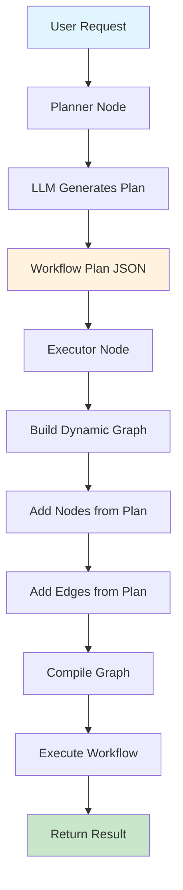
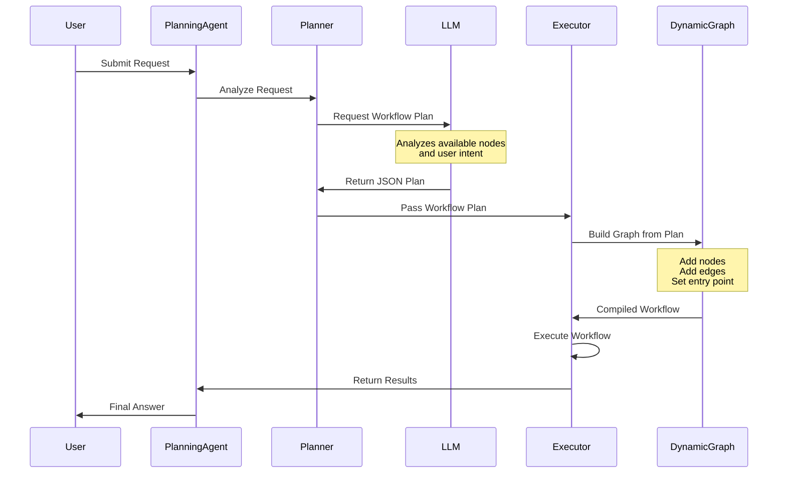

# Planning Agent - Dynamic Workflow Planning with LLM

## Table of Contents

- [Overview](#overview)
- [What is Planning Agent?](#what-is-planning-agent)
- [Architecture](#architecture)
- [How It Works](#how-it-works)
- [API Reference](#api-reference)
- [Usage Guide](#usage-guide)
- [Workflow Plan Format](#workflow-plan-format)
- [Examples](#examples)
- [Best Practices](#best-practices)
- [Comparison with Other Agents](#comparison-with-other-agents)
- [Advanced Features](#advanced-features)

## Overview

The **Planning Agent** is an intelligent agent that dynamically creates and executes workflow plans based on user requests using LLM reasoning. Unlike traditional agents with fixed workflows, the Planning Agent adapts its execution flow to each specific request.

### Key Benefits

- ✅ **Adaptive Workflows**: Different requests generate different workflows automatically
- ✅ **LLM-Powered Planning**: Intelligent workflow generation based on natural language understanding
- ✅ **Flexible Composition**: Reusable nodes can be combined in infinite ways
- ✅ **No Hardcoding**: No need to predefine all possible workflow combinations
- ✅ **Natural Language Interface**: Users describe what they want, not how to do it

## What is Planning Agent?

Traditional agents follow predefined workflows:
```
User Request → Fixed Workflow → Result
```

Planning Agent dynamically creates workflows:
```
User Request → LLM Plans Workflow → Dynamic Execution → Result
```

### The Planning Agent Process

1. **Analyze**: LLM analyzes the user's request and available nodes
2. **Plan**: LLM generates an optimal workflow plan in JSON format
3. **Execute**: The agent dynamically builds and executes the planned workflow

## Architecture

```
┌─────────────────────────────────────────────────────────────┐
│                    Planning Agent                           │
├─────────────────────────────────────────────────────────────┤
│                                                             │
│  ┌──────────────┐      ┌──────────────┐                   │
│  │   Planner    │─────▶│   Executor   │                   │
│  │   Node       │      │   Node       │                   │
│  └──────────────┘      └──────────────┘                   │
│        │                      │                            │
│        │                      │                            │
│        ▼                      ▼                            │
│  Generate JSON        Build & Execute                     │
│  Workflow Plan       Dynamic Workflow                     │
│                                                             │
└─────────────────────────────────────────────────────────────┘
```

### Components

1. **Planner Node**:
   - Receives user request and node descriptions
   - Calls LLM to generate workflow plan
   - Outputs structured JSON plan

2. **Executor Node**:
   - Receives the workflow plan
   - Dynamically builds a graph from the plan
   - Executes the constructed workflow

3. **Workflow Plan**:
   - JSON structure defining nodes and edges
   - Similar to a programmatic Mermaid diagram
   - Validated before execution

## How It Works

### Execution Flow Diagram



### Detailed Sequence



## API Reference

### CreatePlanningAgent

Creates a new Planning Agent that can dynamically plan and execute workflows.

```go
func CreatePlanningAgent(
    model llms.Model,
    nodes []*graph.Node,
    inputTools []tools.Tool,
    opts ...CreateAgentOption,
) (*graph.StateRunnable, error)
```

#### Parameters

- **model** (`llms.Model`): The LLM to use for planning (required)
- **nodes** (`[]*graph.Node`): Available nodes that can be composed into workflows (required)
- **inputTools** (`[]tools.Tool`): Tools available to the agent (can be empty)
- **opts** (`...CreateAgentOption`): Optional configuration

#### Options

```go
// Enable verbose logging
prebuilt.WithVerbose(true)

// Set custom system message
prebuilt.WithSystemMessage("Custom planning instructions")

// Set maximum iterations
prebuilt.WithMaxIterations(10)
```

#### Returns

- **`*graph.StateRunnable`**: Compiled agent ready to execute
- **`error`**: Error if agent creation fails

### WorkflowPlan

The structure representing a workflow plan.

```go
type WorkflowPlan struct {
    Nodes []WorkflowNode `json:"nodes"`
    Edges []WorkflowEdge `json:"edges"`
}

type WorkflowNode struct {
    Name string `json:"name"`
    Type string `json:"type"` // "start", "process", "end", "conditional"
}

type WorkflowEdge struct {
    From      string `json:"from"`
    To        string `json:"to"`
    Condition string `json:"condition,omitempty"` // For conditional edges
}
```

## Usage Guide

### Step 1: Define Available Nodes

Create a collection of reusable nodes that can be composed into workflows.

```go
nodes := []*graph.Node{
    {
        Name:        "fetch_data",
        Description: "Fetch user data from the database",
        Function:    fetchDataNode,
    },
    {
        Name:        "validate_data",
        Description: "Validate the integrity and format of the data",
        Function:    validateDataNode,
    },
    {
        Name:        "transform_data",
        Description: "Transform data to JSON format",
        Function:    transformDataNode,
    },
    {
        Name:        "analyze_data",
        Description: "Analyze data and generate insights",
        Function:    analyzeDataNode,
    },
    {
        Name:        "save_results",
        Description: "Save results to the database",
        Function:    saveResultsNode,
    },
}
```

### Step 2: Implement Node Functions

Each node should follow the standard LangGraphGo node signature.

```go
func fetchDataNode(ctx context.Context, state interface{}) (interface{}, error) {
    mState := state.(map[string]interface{})
    messages := mState["messages"].([]llms.MessageContent)

    // Your business logic here
    fmt.Println("📥 Fetching data from database...")
    data := fetchFromDatabase()

    msg := llms.MessageContent{
        Role:  llms.ChatMessageTypeAI,
        Parts: []llms.ContentPart{
            llms.TextPart(fmt.Sprintf("Data fetched: %d records", len(data))),
        },
    }

    return map[string]interface{}{
        "messages": append(messages, msg),
        "data":     data, // Store data in state
    }, nil
}
```

### Step 3: Create the Planning Agent

```go
import (
    "github.com/smallnest/langgraphgo/prebuilt"
    "github.com/tmc/langchaingo/llms/openai"
)

func main() {
    // Create LLM
    model, err := openai.New()
    if err != nil {
        log.Fatal(err)
    }

    // Create Planning Agent
    agent, err := prebuilt.CreatePlanningAgent(
        model,
        nodes,
        []tools.Tool{}, // No additional tools
        prebuilt.WithVerbose(true),
    )
    if err != nil {
        log.Fatal(err)
    }

    // Execute with user request
    result, err := agent.Invoke(ctx, initialState)
}
```

### Step 4: Execute with User Requests

```go
query := "Fetch user data, validate it, transform to JSON, and save the results"

initialState := map[string]interface{}{
    "messages": []llms.MessageContent{
        llms.TextParts(llms.ChatMessageTypeHuman, query),
    },
}

result, err := agent.Invoke(context.Background(), initialState)
if err != nil {
    log.Fatal(err)
}

// Access results
finalState := result.(map[string]interface{})
messages := finalState["messages"].([]llms.MessageContent)
```

## Workflow Plan Format

The LLM generates a workflow plan in the following JSON format:

```json
{
  "nodes": [
    {"name": "fetch_data", "type": "process"},
    {"name": "validate_data", "type": "process"},
    {"name": "transform_data", "type": "process"},
    {"name": "save_results", "type": "process"}
  ],
  "edges": [
    {"from": "START", "to": "fetch_data"},
    {"from": "fetch_data", "to": "validate_data"},
    {"from": "validate_data", "to": "transform_data"},
    {"from": "transform_data", "to": "save_results"},
    {"from": "save_results", "to": "END"}
  ]
}
```

### Plan Components

- **START**: Special node indicating workflow entry point
- **END**: Special node indicating workflow completion
- **nodes**: Array of nodes to include in the workflow
- **edges**: Array of connections between nodes
- **condition**: Optional field for conditional edges (advanced)

## Examples

### Example 1: Data Processing Pipeline

**User Request**: "Fetch user data, validate it, and save the results"

**Generated Workflow**:
```
START → fetch_data → validate_data → save_results → END
```

**Code**:
```go
query := "Fetch user data, validate it, and save the results"
initialState := map[string]interface{}{
    "messages": []llms.MessageContent{
        llms.TextParts(llms.ChatMessageTypeHuman, query),
    },
}

result, err := agent.Invoke(ctx, initialState)
```

### Example 2: Analysis Pipeline

**User Request**: "Fetch data, analyze it, and generate a report"

**Generated Workflow**:
```
START → fetch_data → analyze_data → generate_report → END
```

### Example 3: Complete ETL Pipeline

**User Request**: "Fetch data, validate and transform it, analyze the results, and save everything"

**Generated Workflow**:
```
START → fetch_data → validate_data → transform_data → analyze_data → save_results → END
```

### Example 4: Conditional Logic

**User Request**: "Fetch data, and if valid, transform and save it, otherwise log the error"

**Generated Workflow** (conceptual):
```
START → fetch_data → validate_data
    ├─[valid]─→ transform_data → save_results → END
    └─[invalid]─→ log_error → END
```

## Best Practices

### 1. Write Clear Node Descriptions

The LLM uses node descriptions to plan workflows. Make them descriptive and specific.

✅ **Good**:
```go
{
    Name:        "validate_email",
    Description: "Validate email format and check if domain exists",
    Function:    validateEmailNode,
}
```

❌ **Bad**:
```go
{
    Name:        "validate",
    Description: "Validates stuff",
    Function:    validateNode,
}
```

### 2. Keep Nodes Focused

Each node should have a single, clear responsibility.

✅ **Good**: Separate nodes for fetch, validate, transform
❌ **Bad**: One node that does everything

### 3. Handle Errors Gracefully

Implement proper error handling in node functions.

```go
func myNode(ctx context.Context, state interface{}) (interface{}, error) {
    mState := state.(map[string]interface{})

    data, err := performOperation()
    if err != nil {
        // Return error message to the workflow
        msg := llms.MessageContent{
            Role:  llms.ChatMessageTypeAI,
            Parts: []llms.ContentPart{
                llms.TextPart(fmt.Sprintf("Error: %v", err)),
            },
        }
        return map[string]interface{}{
            "messages": append(mState["messages"].([]llms.MessageContent), msg),
            "error":    err.Error(),
        }, nil
    }

    // Success case
    return map[string]interface{}{
        "messages": append(mState["messages"].([]llms.MessageContent), successMsg),
        "data":     data,
    }, nil
}
```

### 4. Use Verbose Mode During Development

Enable verbose logging to understand how the LLM plans workflows.

```go
agent, err := prebuilt.CreatePlanningAgent(
    model,
    nodes,
    []tools.Tool{},
    prebuilt.WithVerbose(true), // Enable detailed logging
)
```

### 5. Test with Various Requests

Test your agent with different user requests to ensure robust planning.

```go
testQueries := []string{
    "Just fetch the data",
    "Fetch and validate data",
    "Complete ETL pipeline with validation",
    "Fetch, transform, analyze, and report",
}

for _, query := range testQueries {
    result, err := agent.Invoke(ctx, createState(query))
    // Verify results
}
```

## Comparison with Other Agents

| Feature | ReAct Agent | Supervisor | Planning Agent |
|---------|-------------|------------|----------------|
| **Workflow** | Fixed | Fixed routing logic | Dynamic per request |
| **Planning** | No | No | Yes (LLM-based) |
| **Flexibility** | Low | Medium | High |
| **Complexity** | Low | Medium | High |
| **Use Case** | Tool calling | Multi-agent orchestration | Adaptive workflows |
| **Learning Curve** | Easy | Medium | Medium |
| **Performance** | Fast | Medium | Slower (planning overhead) |
| **Best For** | Simple tasks | Multi-agent systems | Complex, varying workflows |

## Advanced Features

### Custom Planning Prompts

You can customize the planning prompt to guide the LLM's planning behavior.

```go
customPrompt := `You are an expert workflow planner specializing in data pipelines.
Always prioritize data validation before processing.
Include error handling nodes when appropriate.`

agent, err := prebuilt.CreatePlanningAgent(
    model,
    nodes,
    []tools.Tool{},
    prebuilt.WithSystemMessage(customPrompt),
)
```

### State Management

Planning Agent uses a schema-based state with the following channels:

- **messages**: List of conversation messages (uses `AppendReducer`)
- **workflow_plan**: The generated workflow plan (uses `OverwriteReducer`)
- **Custom channels**: You can add your own state channels

```go
// Nodes can access and modify state
func myNode(ctx context.Context, state interface{}) (interface{}, error) {
    mState := state.(map[string]interface{})

    // Access workflow plan
    plan := mState["workflow_plan"].(*prebuilt.WorkflowPlan)

    // Access messages
    messages := mState["messages"].([]llms.MessageContent)

    // Add custom data
    return map[string]interface{}{
        "messages": append(messages, newMsg),
        "my_data":  customData,
    }, nil
}
```

### Debugging

Use verbose mode and inspect the generated plan:

```go
agent, err := prebuilt.CreatePlanningAgent(
    model,
    nodes,
    []tools.Tool{},
    prebuilt.WithVerbose(true),
)

result, err := agent.Invoke(ctx, initialState)

// Inspect final state
finalState := result.(map[string]interface{})
plan := finalState["workflow_plan"].(*prebuilt.WorkflowPlan)
fmt.Printf("Executed plan: %+v\n", plan)
```

## Use Cases

### 1. Data Pipelines
Dynamically compose ETL workflows based on data characteristics and requirements.

### 2. Business Process Automation
Adaptive approval and processing workflows that adjust to different scenarios.

### 3. Multi-step Analysis
Flexible analysis pipelines that adapt based on data types and analysis goals.

### 4. Report Generation
Custom report workflows based on user requirements and available data.

### 5. Task Automation
Intelligently sequence automation tasks based on context and dependencies.

### 6. Customer Service
Route customer requests through appropriate validation, processing, and response steps.

## Troubleshooting

### Planning Fails

**Problem**: LLM doesn't generate valid JSON plan

**Solution**:
- Ensure node descriptions are clear and descriptive
- Check LLM supports JSON output
- Add more examples in custom system prompt

### Wrong Nodes Selected

**Problem**: LLM chooses incorrect nodes for the task

**Solution**:
- Improve node descriptions
- Make node names more semantic
- Add domain-specific guidance in system prompt

### Workflow Doesn't Execute

**Problem**: Dynamic graph fails to compile

**Solution**:
- Validate that all nodes in plan exist in available nodes
- Check for circular dependencies in edges
- Ensure workflow has valid START and END connections

## Next Steps

1. Explore the [Planning Agent Example](../examples/planning_agent/)
2. Define domain-specific node libraries
3. Experiment with conditional workflows
4. Integrate with real databases and APIs
5. Implement error recovery strategies
6. Create reusable node templates

## References

- [LangGraphGo Documentation](../README.md)
- [Planning Agent Example](../examples/planning_agent/)
- [ReAct Agent](./react_agent.md)
- [Supervisor Pattern](./supervisor_pattern.md)
