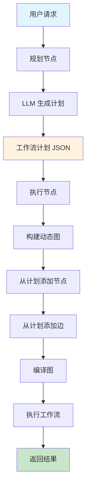
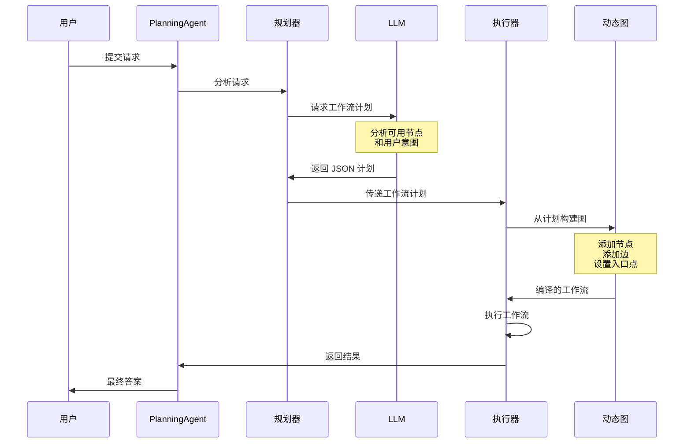

# Planning Agent - 基于 LLM 的动态工作流规划

## 目录

- [概述](#概述)
- [什么是 Planning Agent？](#什么是-planning-agent)
- [架构](#架构)
- [工作原理](#工作原理)
- [API 参考](#api-参考)
- [使用指南](#使用指南)
- [工作流计划格式](#工作流计划格式)
- [示例](#示例)
- [最佳实践](#最佳实践)
- [与其他代理的比较](#与其他代理的比较)
- [高级特性](#高级特性)

## 概述

**Planning Agent（规划代理）** 是一个智能代理，它能够根据用户请求使用 LLM 推理动态创建并执行工作流计划。与具有固定工作流的传统代理不同，Planning Agent 能够针对每个特定请求调整其执行流程。

### 核心优势

- ✅ **自适应工作流**：不同的请求自动生成不同的工作流
- ✅ **LLM 驱动规划**：基于自然语言理解的智能工作流生成
- ✅ **灵活组合**：可重用节点可以以无限方式组合
- ✅ **无需硬编码**：不需要预定义所有可能的工作流组合
- ✅ **自然语言接口**：用户描述他们想要什么，而不是如何做

## 什么是 Planning Agent？

传统代理遵循预定义的工作流：
```
用户请求 → 固定工作流 → 结果
```

Planning Agent 动态创建工作流：
```
用户请求 → LLM 规划工作流 → 动态执行 → 结果
```

### Planning Agent 流程

1. **分析**：LLM 分析用户的请求和可用节点
2. **规划**：LLM 生成 JSON 格式的最优工作流计划
3. **执行**：代理动态构建并执行计划的工作流

## 架构

```
┌─────────────────────────────────────────────────────────────┐
│                    Planning Agent                           │
├─────────────────────────────────────────────────────────────┤
│                                                             │
│  ┌──────────────┐      ┌──────────────┐                   │
│  │   规划节点   │─────▶│   执行节点   │                   │
│  │   Planner    │      │   Executor   │                   │
│  └──────────────┘      └──────────────┘                   │
│        │                      │                            │
│        │                      │                            │
│        ▼                      ▼                            │
│  生成 JSON            构建并执行                           │
│  工作流计划           动态工作流                           │
│                                                             │
└─────────────────────────────────────────────────────────────┘
```

### 组件

1. **规划节点（Planner Node）**：
   - 接收用户请求和节点描述
   - 调用 LLM 生成工作流计划
   - 输出结构化 JSON 计划

2. **执行节点（Executor Node）**：
   - 接收工作流计划
   - 从计划动态构建图
   - 执行构建的工作流

3. **工作流计划（Workflow Plan）**：
   - 定义节点和边的 JSON 结构
   - 类似于程序化的 Mermaid 图
   - 执行前验证

## 工作原理

### 执行流程图



### 详细序列



## API 参考

### CreatePlanningAgent

创建一个新的 Planning Agent，可以动态规划和执行工作流。

```go
func CreatePlanningAgent(
    model llms.Model,
    nodes []*graph.Node,
    inputTools []tools.Tool,
    opts ...CreateAgentOption,
) (*graph.StateRunnable, error)
```

#### 参数

- **model** (`llms.Model`)：用于规划的 LLM（必需）
- **nodes** (`[]*graph.Node`)：可以组合成工作流的可用节点（必需）
- **inputTools** (`[]tools.Tool`)：代理可用的工具（可以为空）
- **opts** (`...CreateAgentOption`)：可选配置

#### 选项

```go
// 启用详细日志
prebuilt.WithVerbose(true)

// 设置自定义系统消息
prebuilt.WithSystemMessage("自定义规划指令")

// 设置最大迭代次数
prebuilt.WithMaxIterations(10)
```

#### 返回值

- **`*graph.StateRunnable`**：编译好的代理，准备执行
- **`error`**：如果代理创建失败则返回错误

### WorkflowPlan

表示工作流计划的结构。

```go
type WorkflowPlan struct {
    Nodes []WorkflowNode `json:"nodes"`
    Edges []WorkflowEdge `json:"edges"`
}

type WorkflowNode struct {
    Name string `json:"name"`
    Type string `json:"type"` // "start", "process", "end", "conditional"
}

type WorkflowEdge struct {
    From      string `json:"from"`
    To        string `json:"to"`
    Condition string `json:"condition,omitempty"` // 用于条件边
}
```

## 使用指南

### 步骤 1：定义可用节点

创建可以组合成工作流的可重用节点集合。

```go
nodes := []*graph.Node{
    {
        Name:        "fetch_data",
        Description: "从数据库获取用户数据",
        Function:    fetchDataNode,
    },
    {
        Name:        "validate_data",
        Description: "验证数据的完整性和格式",
        Function:    validateDataNode,
    },
    {
        Name:        "transform_data",
        Description: "将数据转换为 JSON 格式",
        Function:    transformDataNode,
    },
    {
        Name:        "analyze_data",
        Description: "分析数据并生成见解",
        Function:    analyzeDataNode,
    },
    {
        Name:        "save_results",
        Description: "将结果保存到数据库",
        Function:    saveResultsNode,
    },
}
```

### 步骤 2：实现节点函数

每个节点应遵循标准的 LangGraphGo 节点签名。

```go
func fetchDataNode(ctx context.Context, state interface{}) (interface{}, error) {
    mState := state.(map[string]interface{})
    messages := mState["messages"].([]llms.MessageContent)

    // 你的业务逻辑
    fmt.Println("📥 从数据库获取数据...")
    data := fetchFromDatabase()

    msg := llms.MessageContent{
        Role:  llms.ChatMessageTypeAI,
        Parts: []llms.ContentPart{
            llms.TextPart(fmt.Sprintf("数据已获取：%d 条记录", len(data))),
        },
    }

    return map[string]interface{}{
        "messages": append(messages, msg),
        "data":     data, // 在状态中存储数据
    }, nil
}
```

### 步骤 3：创建 Planning Agent

```go
import (
    "github.com/smallnest/langgraphgo/prebuilt"
    "github.com/tmc/langchaingo/llms/openai"
)

func main() {
    // 创建 LLM
    model, err := openai.New()
    if err != nil {
        log.Fatal(err)
    }

    // 创建 Planning Agent
    agent, err := prebuilt.CreatePlanningAgent(
        model,
        nodes,
        []tools.Tool{}, // 没有额外的工具
        prebuilt.WithVerbose(true),
    )
    if err != nil {
        log.Fatal(err)
    }

    // 使用用户请求执行
    result, err := agent.Invoke(ctx, initialState)
}
```

### 步骤 4：使用用户请求执行

```go
query := "获取用户数据，验证它，转换为 JSON，并保存结果"

initialState := map[string]interface{}{
    "messages": []llms.MessageContent{
        llms.TextParts(llms.ChatMessageTypeHuman, query),
    },
}

result, err := agent.Invoke(context.Background(), initialState)
if err != nil {
    log.Fatal(err)
}

// 访问结果
finalState := result.(map[string]interface{})
messages := finalState["messages"].([]llms.MessageContent)
```

## 工作流计划格式

LLM 生成以下 JSON 格式的工作流计划：

```json
{
  "nodes": [
    {"name": "fetch_data", "type": "process"},
    {"name": "validate_data", "type": "process"},
    {"name": "transform_data", "type": "process"},
    {"name": "save_results", "type": "process"}
  ],
  "edges": [
    {"from": "START", "to": "fetch_data"},
    {"from": "fetch_data", "to": "validate_data"},
    {"from": "validate_data", "to": "transform_data"},
    {"from": "transform_data", "to": "save_results"},
    {"from": "save_results", "to": "END"}
  ]
}
```

### 计划组件

- **START**：表示工作流入口点的特殊节点
- **END**：表示工作流完成的特殊节点
- **nodes**：要包含在工作流中的节点数组
- **edges**：节点之间的连接数组
- **condition**：条件边的可选字段（高级功能）

## 示例

### 示例 1：数据处理管道

**用户请求**："获取用户数据，验证它，并保存结果"

**生成的工作流**：
```
START → fetch_data → validate_data → save_results → END
```

**代码**：
```go
query := "获取用户数据，验证它，并保存结果"
initialState := map[string]interface{}{
    "messages": []llms.MessageContent{
        llms.TextParts(llms.ChatMessageTypeHuman, query),
    },
}

result, err := agent.Invoke(ctx, initialState)
```

### 示例 2：分析管道

**用户请求**："获取数据，分析它，并生成报告"

**生成的工作流**：
```
START → fetch_data → analyze_data → generate_report → END
```

### 示例 3：完整 ETL 管道

**用户请求**："获取数据，验证和转换它，分析结果，并保存所有内容"

**生成的工作流**：
```
START → fetch_data → validate_data → transform_data → analyze_data → save_results → END
```

### 示例 4：条件逻辑

**用户请求**："获取数据，如果有效则转换并保存，否则记录错误"

**生成的工作流**（概念性）：
```
START → fetch_data → validate_data
    ├─[有效]─→ transform_data → save_results → END
    └─[无效]─→ log_error → END
```

## 最佳实践

### 1. 编写清晰的节点描述

LLM 使用节点描述来规划工作流。使它们具有描述性和特定性。

✅ **好**：
```go
{
    Name:        "validate_email",
    Description: "验证电子邮件格式并检查域是否存在",
    Function:    validateEmailNode,
}
```

❌ **差**：
```go
{
    Name:        "validate",
    Description: "验证东西",
    Function:    validateNode,
}
```

### 2. 保持节点专注

每个节点应该有单一、明确的职责。

✅ **好**：为获取、验证、转换分别创建独立节点
❌ **差**：一个节点做所有事情

### 3. 优雅地处理错误

在节点函数中实现适当的错误处理。

```go
func myNode(ctx context.Context, state interface{}) (interface{}, error) {
    mState := state.(map[string]interface{})

    data, err := performOperation()
    if err != nil {
        // 向工作流返回错误消息
        msg := llms.MessageContent{
            Role:  llms.ChatMessageTypeAI,
            Parts: []llms.ContentPart{
                llms.TextPart(fmt.Sprintf("错误：%v", err)),
            },
        }
        return map[string]interface{}{
            "messages": append(mState["messages"].([]llms.MessageContent), msg),
            "error":    err.Error(),
        }, nil
    }

    // 成功情况
    return map[string]interface{}{
        "messages": append(mState["messages"].([]llms.MessageContent), successMsg),
        "data":     data,
    }, nil
}
```

### 4. 在开发期间使用详细模式

启用详细日志以了解 LLM 如何规划工作流。

```go
agent, err := prebuilt.CreatePlanningAgent(
    model,
    nodes,
    []tools.Tool{},
    prebuilt.WithVerbose(true), // 启用详细日志
)
```

### 5. 使用各种请求进行测试

使用不同的用户请求测试您的代理，以确保稳健的规划。

```go
testQueries := []string{
    "只获取数据",
    "获取并验证数据",
    "带验证的完整 ETL 管道",
    "获取、转换、分析和报告",
}

for _, query := range testQueries {
    result, err := agent.Invoke(ctx, createState(query))
    // 验证结果
}
```

## 与其他代理的比较

| 特性 | ReAct Agent | Supervisor | Planning Agent |
|------|-------------|------------|----------------|
| **工作流** | 固定 | 固定路由逻辑 | 每个请求动态生成 |
| **规划** | 无 | 无 | 是（基于 LLM） |
| **灵活性** | 低 | 中 | 高 |
| **复杂度** | 低 | 中 | 高 |
| **使用场景** | 工具调用 | 多代理编排 | 自适应工作流 |
| **学习曲线** | 简单 | 中等 | 中等 |
| **性能** | 快 | 中 | 较慢（规划开销） |
| **最适合** | 简单任务 | 多代理系统 | 复杂、多变的工作流 |

## 高级特性

### 自定义规划提示

您可以自定义规划提示来指导 LLM 的规划行为。

```go
customPrompt := `你是一个专注于数据管道的专家工作流规划师。
始终在处理前优先进行数据验证。
在适当时包含错误处理节点。`

agent, err := prebuilt.CreatePlanningAgent(
    model,
    nodes,
    []tools.Tool{},
    prebuilt.WithSystemMessage(customPrompt),
)
```

### 状态管理

Planning Agent 使用基于 schema 的状态，具有以下通道：

- **messages**：对话消息列表（使用 `AppendReducer`）
- **workflow_plan**：生成的工作流计划（使用 `OverwriteReducer`）
- **自定义通道**：您可以添加自己的状态通道

```go
// 节点可以访问和修改状态
func myNode(ctx context.Context, state interface{}) (interface{}, error) {
    mState := state.(map[string]interface{})

    // 访问工作流计划
    plan := mState["workflow_plan"].(*prebuilt.WorkflowPlan)

    // 访问消息
    messages := mState["messages"].([]llms.MessageContent)

    // 添加自定义数据
    return map[string]interface{}{
        "messages": append(messages, newMsg),
        "my_data":  customData,
    }, nil
}
```

### 调试

使用详细模式并检查生成的计划：

```go
agent, err := prebuilt.CreatePlanningAgent(
    model,
    nodes,
    []tools.Tool{},
    prebuilt.WithVerbose(true),
)

result, err := agent.Invoke(ctx, initialState)

// 检查最终状态
finalState := result.(map[string]interface{})
plan := finalState["workflow_plan"].(*prebuilt.WorkflowPlan)
fmt.Printf("执行的计划：%+v\n", plan)
```

## 使用场景

### 1. 数据管道
根据数据特征和需求动态组合 ETL 工作流。

### 2. 业务流程自动化
适应不同场景的自适应审批和处理工作流。

### 3. 多步分析
根据数据类型和分析目标调整的灵活分析管道。

### 4. 报告生成
基于用户需求和可用数据的自定义报告工作流。

### 5. 任务自动化
基于上下文和依赖关系智能排序自动化任务。

### 6. 客户服务
通过适当的验证、处理和响应步骤路由客户请求。

## 故障排除

### 规划失败

**问题**：LLM 不生成有效的 JSON 计划

**解决方案**：
- 确保节点描述清晰且具有描述性
- 检查 LLM 是否支持 JSON 输出
- 在自定义系统提示中添加更多示例

### 选择了错误的节点

**问题**：LLM 为任务选择不正确的节点

**解决方案**：
- 改进节点描述
- 使节点名称更具语义
- 在系统提示中添加特定领域的指导

### 工作流无法执行

**问题**：动态图编译失败

**解决方案**：
- 验证计划中的所有节点都存在于可用节点中
- 检查边中的循环依赖
- 确保工作流具有有效的 START 和 END 连接

## 下一步

1. 探索 [Planning Agent 示例](../examples/planning_agent/)
2. 定义特定领域的节点库
3. 尝试条件工作流
4. 与真实数据库和 API 集成
5. 实现错误恢复策略
6. 创建可重用的节点模板

## 参考

- [LangGraphGo 文档](../README_CN.md)
- [Planning Agent 示例](../examples/planning_agent/)
- [ReAct Agent](./react_agent_cn.md)
- [Supervisor 模式](./supervisor_pattern_cn.md)
