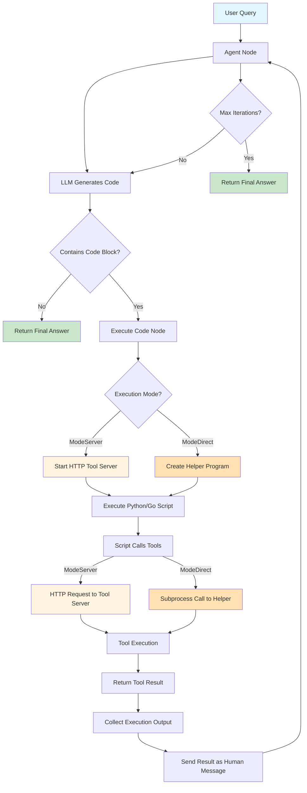
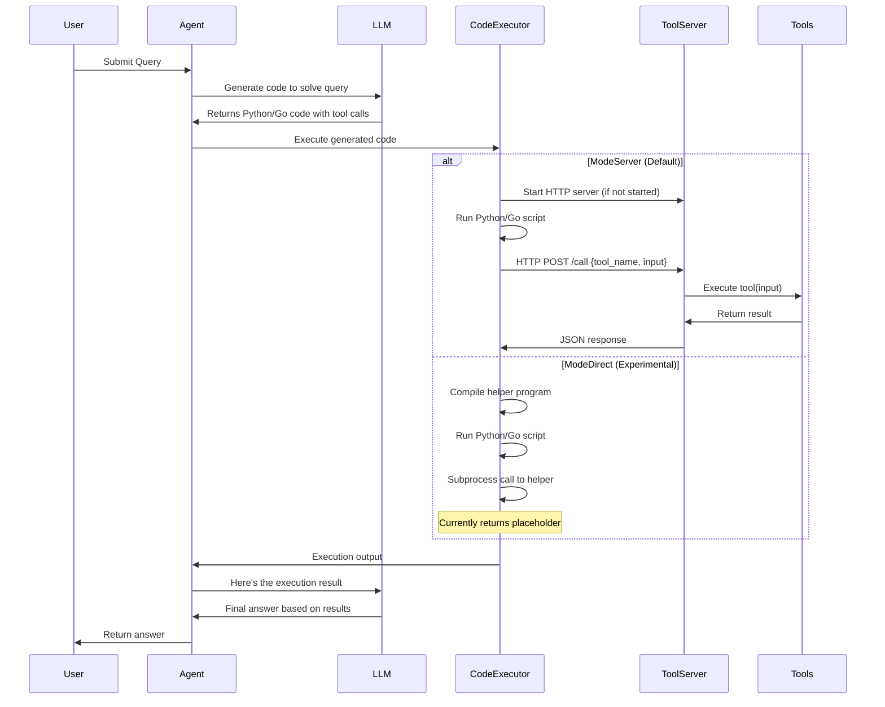

# Programmatic Tool Calling (PTC) for LangGraph Go

Programmatic Tool Calling (PTC) is an advanced technique that allows LLMs to write code that calls tools programmatically within a code execution environment, rather than requiring round-trips through the model for each tool invocation.

## Table of Contents

- [What is PTC?](#what-is-ptc)
- [Advantages](#advantages)
- [Architecture](#architecture)
- [Quick Start](#quick-start)
- [Examples](#examples)
- [Supported LLMs](#supported-llms)
- [API Reference](#api-reference)

## What is PTC?

Traditional tool calling requires multiple API round-trips:
```
User Query → LLM → Tool Call → Tool Result → LLM → Tool Call → ... → Final Answer
```

With PTC, the LLM writes code that calls tools directly:
```
User Query → LLM → Code (with tool calls) → Execute Code → LLM → Final Answer
```

The LLM generates code (Python or Go) that:
1. Calls multiple tools sequentially or in parallel
2. Processes and filters large datasets
3. Implements custom logic with loops and conditionals
4. Returns only the relevant results

## Advantages

### 1. Reduced Latency
- **Traditional**: Each tool call = one API round-trip
- **PTC**: Multiple tool calls in single code execution

### 2. Token Efficiency
- **Traditional**: All tool results sent back to model
- **PTC**: Code filters data before returning results

### 3. Programmatic Control
- Write loops to process lists
- Filter and aggregate data
- Handle complex dependencies
- Implement custom business logic

### 4. Cost Savings
- Fewer API calls
- Less token consumption
- Better handling of large datasets

## Architecture

```
┌─────────────────────────────────────────────────────────┐
│                      PTC Agent                          │
├─────────────────────────────────────────────────────────┤
│                                                         │
│  ┌──────────┐      ┌──────────────┐      ┌─────────┐  │
│  │   LLM    │─────▶│ Code         │─────▶│ Tool    │  │
│  │          │      │ Executor     │◀─────│ Server  │  │
│  └──────────┘      └──────────────┘      └─────────┘  │
│       │                   │                     │      │
│       │                   │                     │      │
│       ▼                   ▼                     ▼      │
│  Generates Code    Executes Python/Go    HTTP API     │
│                    with Tool Access      for Tools    │
└─────────────────────────────────────────────────────────┘
```

### Components

1. **PTCToolNode**: Graph node that executes generated code
2. **CodeExecutor**: Executes Python or Go code with tool access
3. **ToolServer**: HTTP server that exposes tools via REST API
4. **CreatePTCAgent**: Builder function to create PTC-enabled agents

## Quick Start

### Installation

```bash
go get github.com/smallnest/langgraphgo
```

### Basic Example

```go
package main

import (
    "context"
    "github.com/tmc/langchaingo/llms/openai"
    "github.com/tmc/langchaingo/tools"
    "github.com/smallnest/langgraphgo/ptc"
)

func main() {
    // 1. Create LLM (any model that implements llms.Model)
    model, _ := openai.New(openai.WithModel("gpt-4"))

    // 2. Define tools
    toolList := []tools.Tool{
        MyCalculatorTool{},
        MyWeatherTool{},
    }

    // 3. Create PTC agent
    agent, _ := ptc.CreatePTCAgent(ptc.PTCAgentConfig{
        Model:          model,
        Tools:          toolList,
        Language:       ptc.LanguagePython, // or ptc.LanguageGo
        ExecutionMode:  ptc.ModeServer,     // or ptc.ModeDirect (default: ModeServer, recommended)
        MaxIterations:  10,
    })

    // 4. Run query
    result, _ := agent.Invoke(context.Background(), map[string]interface{}{
        "messages": []llms.MessageContent{
            {
                Role:  llms.ChatMessageTypeHuman,
                Parts: []llms.ContentPart{llms.TextPart("Your query here")},
            },
        },
    })
}
```

### Implementing a Tool

Tools must implement the `tools.Tool` interface:

```go
type MyTool struct{}

func (t MyTool) Name() string {
    return "my_tool"
}

func (t MyTool) Description() string {
    return "Description of what this tool does and how to use it."
}

func (t MyTool) Call(ctx context.Context, input string) (string, error) {
    // Tool implementation
    return "result", nil
}
```

## Examples

### Example 1: Simple Calculator

See: [`examples/ptc_simple/main.go`](../examples/ptc_simple/main.go)

Demonstrates basic PTC usage with simple tools.

### Example 2: Expense Analysis

See: [`examples/ptc_expense_analysis/main.go`](../examples/ptc_expense_analysis/main.go)

Based on the [Anthropic PTC Cookbook](https://github.com/anthropics/claude-cookbooks/blob/main/tool_use/programmatic_tool_calling_ptc.ipynb), this example shows:

- Handling large datasets (100+ expense records)
- Sequential tool dependencies
- Data filtering and aggregation
- Complex business logic

**Use Case**: Analyze which employees exceeded their quarterly travel budget, accounting for custom budget exceptions.

**PTC Benefits in this scenario**:
- Filters approved expenses programmatically
- Checks custom budgets only for employees who exceed standard limit
- Reduces token usage by 10x compared to traditional approach
- Completes in 1-2 API calls instead of 10+

### Example 3: Multi-LLM Support

```go
// Use OpenAI
model, _ := openai.New()

// Or use Google Gemini
model, _ := googleai.New(ctx)

// Or any other LLM that implements llms.Model interface
agent, _ := ptc.CreatePTCAgent(ptc.PTCAgentConfig{
    Model: model, // Works with any LLM
    // ...
})
```

## Supported LLMs

PTC works with **any LLM** that implements the `llms.Model` interface from langchaingo.

Tested with:
- ✅ OpenAI (GPT-4, GPT-3.5)
- ✅ Google Gemini
- ✅ Anthropic Claude (via langchaingo)
- ✅ Any other langchaingo-compatible model

## API Reference

### PTCAgentConfig

Configuration for creating a PTC agent:

```go
type PTCAgentConfig struct {
    // Model is the LLM to use (required)
    Model llms.Model

    // Tools are the available tools (required)
    Tools []tools.Tool

    // Language is the execution language for code (default: Python)
    Language ExecutionLanguage

    // ExecutionMode determines how tools are executed (default: ModeServer)
    ExecutionMode ExecutionMode

    // SystemPrompt is custom system prompt (optional)
    SystemPrompt string

    // MaxIterations limits the number of iterations (default: 10)
    MaxIterations int
}
```

### CreatePTCAgent

Creates a new PTC-enabled agent:

```go
func CreatePTCAgent(config PTCAgentConfig) (*graph.CompiledStateGraph, error)
```

Returns a compiled graph that can be invoked with:

```go
result, err := agent.Invoke(ctx, initialState)
```

### ExecutionLanguage

Supported code execution languages:

```go
const (
    LanguagePython ExecutionLanguage = "python"
    LanguageGo     ExecutionLanguage = "go"
)
```

**Note**: Python is recommended as it's more widely supported by LLMs.

### ExecutionMode

Two execution modes are supported:

```go
const (
    // ModeServer: Tools are called via HTTP server (default, recommended)
    ModeServer ExecutionMode = "server"

    // ModeDirect: Tools are executed directly via subprocess (experimental)
    ModeDirect ExecutionMode = "direct"
)
```

**Comparison**:

| Feature | ModeServer | ModeDirect |
|---------|-----------|------------|
| **Status** | ✅ Production Ready | ⚠️ Experimental |
| **Implementation** | Fully implemented | Placeholder only |
| **Default** | ✅ Yes | No |
| **Performance** | Good (HTTP overhead) | N/A |
| **Isolation** | Network-level | Process-level |
| **Debugging** | Easier (HTTP logs) | Harder |
| **Recommended** | ✅ Yes | ❌ Not yet |

**When to use ModeServer** (recommended):
- All production use cases (default)
- Executing LLM-generated code
- Need reliable tool execution
- Normal operation

**When to use ModeDirect**:
- ⚠️ Not recommended - currently experimental
- Uses placeholder implementations
- Work in progress

### CodeExecutor

Low-level code executor (advanced usage):

```go
executor := ptc.NewCodeExecutor(ptc.LanguagePython, tools)

// Start tool server
executor.Start(ctx)
defer executor.Stop(ctx)

// Execute code
result, err := executor.Execute(ctx, code)
```

### ToolServer

HTTP server for tool access (automatically managed):

```go
server := ptc.NewToolServer(tools)
server.Start(ctx)
defer server.Stop(ctx)

// Get server URL for code execution
url := server.GetBaseURL() // http://127.0.0.1:PORT
```

## How It Works

### Execution Flow Diagram



### Detailed Flow



### 1. Agent Creation

```go
agent, _ := ptc.CreatePTCAgent(config)
```

- Creates a StateGraph with agent and code execution nodes
- Starts an HTTP tool server on localhost
- Configures the LLM with system prompts and tool descriptions

### 2. Query Processing

```
User Query → Agent Node
```

The agent receives the query and tool descriptions.

### 3. Code Generation

```
Agent Node → LLM → Generated Code
```

The LLM writes Python/Go code that:
- Calls tools via function calls
- Processes results
- Returns final answer

### 4. Code Execution

```
Generated Code → CodeExecutor → ToolServer → Tools
```

- Code is executed in a sandboxed environment
- Tool calls are made via HTTP to the tool server
- Results are returned to the agent

### 5. Final Answer

```
Execution Results → Agent Node → Final Answer
```

The agent receives execution results and provides the final answer.

## Best Practices

### 1. Choose the Right Language

- **Python**: Better LLM support, more examples in training data
- **Go**: Better performance, type safety

### 2. Design Good Tool Descriptions

```go
func (t MyTool) Description() string {
    return `Detailed description of what the tool does.

    Input format: JSON with fields {...}
    Output format: JSON with fields {...}

    Example: {"field": "value"}`
}
```

### 3. Handle Large Datasets

PTC shines when dealing with large data:

```python
# Instead of returning all data:
all_expenses = get_expenses(employee_id, quarter)

# Filter in code:
approved = [e for e in all_expenses if e['status'] == 'approved']
total = sum(e['amount'] for e in approved)

print(f"Total approved: ${total}")
```

### 4. Set Appropriate Limits

```go
PTCAgentConfig{
    MaxIterations: 10,  // Prevent infinite loops
    // ...
}
```

### 5. Custom System Prompts

```go
PTCAgentConfig{
    SystemPrompt: `You are a financial analyst assistant.

    When analyzing expenses:
    1. Only count approved expenses
    2. Check for custom budget exceptions
    3. Provide detailed breakdowns`,
    // ...
}
```

## Comparison: Traditional vs PTC

| Aspect | Traditional | PTC |
|--------|------------|-----|
| **API Calls** | One per tool use | One per iteration |
| **Token Usage** | All tool results | Filtered results only |
| **Latency** | High (multiple round-trips) | Low (single execution) |
| **Data Processing** | Model must reason | Code-based filtering |
| **Complex Logic** | Difficult | Easy (loops, conditionals) |
| **Large Datasets** | Token-heavy | Efficient filtering |

## Troubleshooting

### Code Execution Errors

- Ensure Python 3 or Go is installed
- Check tool server is running (automatic)
- Review generated code in debug messages

### Tool Not Found

- Verify tool implements `tools.Tool` interface
- Check tool name matches in code
- Ensure tools are passed to agent config

### Max Iterations Reached

- Increase `MaxIterations` in config
- Simplify the query
- Check for infinite loops in generated code

## Contributing

Contributions are welcome! Please see the main [LangGraph Go repository](https://github.com/smallnest/langgraphgo).

## License

Same as LangGraph Go - see main repository.

## References

- [Anthropic PTC Cookbook](https://github.com/anthropics/claude-cookbooks/blob/main/tool_use/programmatic_tool_calling_ptc.ipynb)
- [LangGraph Go Documentation](https://github.com/smallnest/langgraphgo)
- [LangChain Go](https://github.com/tmc/langchaingo)

## Credits

Inspired by Anthropic's Programmatic Tool Calling pattern, implemented for Go with multi-LLM support.
