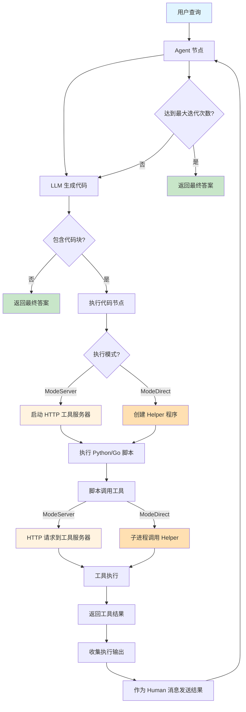
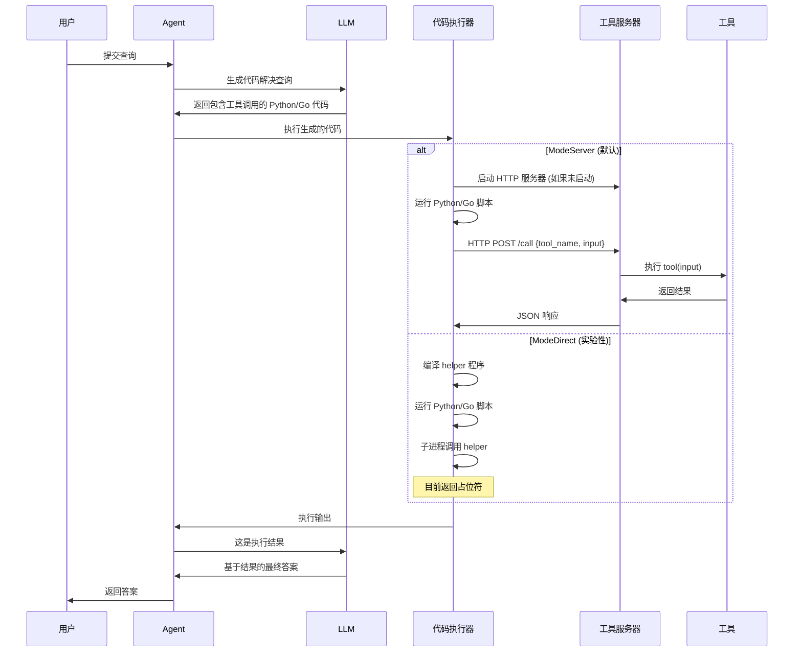

# Programmatic Tool Calling (PTC) - 程序化工具调用

程序化工具调用 (PTC) 是一种先进的技术，允许 LLM 在代码执行环境中编写程序化调用工具的代码，而不是为每次工具调用都需要通过模型进行往返通信。

## 目录

- [什么是 PTC？](#什么是-ptc)
- [优势](#优势)
- [架构](#架构)
- [快速开始](#快速开始)
- [示例](#示例)
- [支持的 LLM](#支持的-llm)
- [API 参考](#api-参考)

## 什么是 PTC？

传统的工具调用需要多次 API 往返：
```
用户查询 → LLM → 工具调用 → 工具结果 → LLM → 工具调用 → ... → 最终答案
```

使用 PTC，LLM 编写直接调用工具的代码：
```
用户查询 → LLM → 代码（包含工具调用）→ 执行代码 → LLM → 最终答案
```

LLM 生成的代码（Python 或 Go）可以：
1. 顺序或并行调用多个工具
2. 处理和过滤大型数据集
3. 实现带有循环和条件的自定义逻辑
4. 只返回相关结果

## 优势

### 1. 降低延迟
- **传统方式**：每次工具调用 = 一次 API 往返
- **PTC**：多次工具调用在单次代码执行中完成

### 2. Token 效率
- **传统方式**：所有工具结果都发送回模型
- **PTC**：代码在返回结果前进行过滤

### 3. 程序化控制
- 编写循环处理列表
- 过滤和聚合数据
- 处理复杂的依赖关系
- 实现自定义业务逻辑

### 4. 成本节省
- 更少的 API 调用
- 更少的 token 消耗
- 更好地处理大型数据集

## 架构

```
┌─────────────────────────────────────────────────────────┐
│                      PTC Agent                          │
├─────────────────────────────────────────────────────────┤
│                                                         │
│  ┌──────────┐      ┌──────────────┐      ┌─────────┐  │
│  │   LLM    │─────▶│ 代码         │─────▶│ 工具    │  │
│  │          │      │ 执行器       │◀─────│ 服务器  │  │
│  └──────────┘      └──────────────┘      └─────────┘  │
│       │                   │                     │      │
│       │                   │                     │      │
│       ▼                   ▼                     ▼      │
│  生成代码          执行 Python/Go    工具的 HTTP API   │
│                    并访问工具                          │
└─────────────────────────────────────────────────────────┘
```

### 组件

1. **PTCToolNode**：执行生成代码的图节点
2. **CodeExecutor**：执行带有工具访问的 Python 或 Go 代码
3. **ToolServer**：通过 REST API 暴露工具的 HTTP 服务器
4. **CreatePTCAgent**：创建支持 PTC 的 agent 的构建函数

## 快速开始

### 安装

```bash
go get github.com/smallnest/langgraphgo
```

### 基础示例

```go
package main

import (
    "context"
    "github.com/tmc/langchaingo/llms/openai"
    "github.com/tmc/langchaingo/tools"
    "github.com/smallnest/langgraphgo/ptc"
)

func main() {
    // 1. 创建 LLM（任何实现 llms.Model 的模型）
    model, _ := openai.New(openai.WithModel("gpt-4"))

    // 2. 定义工具
    toolList := []tools.Tool{
        MyCalculatorTool{},
        MyWeatherTool{},
    }

    // 3. 创建 PTC agent
    agent, _ := ptc.CreatePTCAgent(ptc.PTCAgentConfig{
        Model:         model,
        Tools:         toolList,
        Language:       ptc.LanguagePython, // 或 ptc.LanguageGo
        ExecutionMode:  ptc.ModeServer,     // 或 ptc.ModeDirect (默认: ModeServer，推荐)
        MaxIterations: 10,
    })

    // 4. 运行查询
    result, _ := agent.Invoke(context.Background(), map[string]interface{}{
        "messages": []llms.MessageContent{
            {
                Role:  llms.ChatMessageTypeHuman,
                Parts: []llms.ContentPart{llms.TextPart("你的查询")},
            },
        },
    })
}
```

### 实现工具

工具必须实现 `tools.Tool` 接口：

```go
type MyTool struct{}

func (t MyTool) Name() string {
    return "my_tool"
}

func (t MyTool) Description() string {
    return "工具的功能描述和使用方法"
}

func (t MyTool) Call(ctx context.Context, input string) (string, error) {
    // 工具实现
    return "result", nil
}
```

## 示例

### 示例 1：简单计算器

参见：[`examples/ptc_simple/main.go`](../examples/ptc_simple/main.go)

演示基本的 PTC 使用和简单工具。

### 示例 2：费用分析

参见：[`examples/ptc_expense_analysis/main.go`](../examples/ptc_expense_analysis/main.go)

基于 [Anthropic PTC Cookbook](https://github.com/anthropics/claude-cookbooks/blob/main/tool_use/programmatic_tool_calling_ptc.ipynb)，这个示例展示：

- 处理大型数据集（100+ 费用记录）
- 顺序工具依赖
- 数据过滤和聚合
- 复杂业务逻辑

**用例**：分析哪些员工超过了季度差旅预算，考虑自定义预算例外。

**PTC 在此场景的优势**：
- 程序化过滤已批准的费用
- 仅对超过标准限额的员工检查自定义预算
- 相比传统方式减少 10 倍 token 使用
- 1-2 次 API 调用完成，而不是 10+ 次

### 示例 3：多 LLM 支持

```go
// 使用 OpenAI
model, _ := openai.New()

// 或使用 Google Gemini
model, _ := googleai.New(ctx)

// 或任何其他实现 llms.Model 接口的 LLM
agent, _ := ptc.CreatePTCAgent(ptc.PTCAgentConfig{
    Model: model, // 适用于任何 LLM
    // ...
})
```

## 支持的 LLM

PTC 适用于**任何**实现 langchaingo 的 `llms.Model` 接口的 LLM。

已测试：
- ✅ OpenAI (GPT-4, GPT-3.5)
- ✅ Google Gemini
- ✅ Anthropic Claude (通过 langchaingo)
- ✅ 任何其他兼容 langchaingo 的模型

## API 参考

### PTCAgentConfig

创建 PTC agent 的配置：

```go
type PTCAgentConfig struct {
    // Model 是要使用的 LLM（必需）
    Model llms.Model

    // Tools 是可用的工具（必需）
    Tools []tools.Tool

    // Language 是代码执行语言（默认：Python）
    Language ExecutionLanguage

    // ExecutionMode 决定工具的执行方式（默认：ModeServer）
    ExecutionMode ExecutionMode

    // SystemPrompt 是自定义系统提示（可选）
    SystemPrompt string

    // MaxIterations 限制迭代次数（默认：10）
    MaxIterations int
}
```

### CreatePTCAgent

创建支持 PTC 的新 agent：

```go
func CreatePTCAgent(config PTCAgentConfig) (*graph.CompiledStateGraph, error)
```

返回一个可以调用的编译图：

```go
result, err := agent.Invoke(ctx, initialState)
```

### ExecutionLanguage

支持的代码执行语言：

```go
const (
    LanguagePython ExecutionLanguage = "python"
    LanguageGo     ExecutionLanguage = "go"
)
```

**注意**：推荐使用 Python，因为它被 LLM 更广泛支持。

### ExecutionMode

支持两种执行模式：

```go
const (
    // ModeServer: 通过 HTTP 服务器调用工具（默认，推荐）
    ModeServer ExecutionMode = "server"

    // ModeDirect: 通过子进程直接执行工具（实验性）
    ModeDirect ExecutionMode = "direct"
)
```

**对比**:

| 特性 | ModeServer | ModeDirect |
|------|-----------|------------|
| **状态** | ✅ 生产就绪 | ⚠️ 实验性 |
| **实现** | 完全实现 | 仅占位符 |
| **默认** | ✅ 是 | 否 |
| **性能** | 良好（HTTP 开销） | 不适用 |
| **隔离** | 网络级别 | 进程级别 |
| **调试** | 更容易（HTTP 日志） | 较难 |
| **推荐** | ✅ 是 | ❌ 暂不推荐 |

**何时使用 ModeServer**（推荐）:
- 所有生产用例（默认）
- 执行 LLM 生成的代码
- 需要可靠的工具执行
- 正常操作

**何时使用 ModeDirect**:
- ⚠️ 不推荐 - 目前为实验性
- 使用占位符实现
- 正在开发中

## 工作原理

### 执行流程图



### 详细流程



### 1. Agent 创建

```go
agent, _ := ptc.CreatePTCAgent(config)
```

- 创建带有 agent 和代码执行节点的 StateGraph
- 在 localhost 上启动 HTTP 工具服务器
- 配置 LLM 的系统提示和工具描述

### 2. 查询处理

```
用户查询 → Agent 节点
```

Agent 接收查询和工具描述。

### 3. 代码生成

```
Agent 节点 → LLM → 生成的代码
```

LLM 编写 Python/Go 代码来：
- 通过函数调用工具
- 处理结果
- 返回最终答案

### 4. 代码执行

```
生成的代码 → CodeExecutor → ToolServer → Tools
```

- 代码在沙箱环境中执行
- 通过 HTTP 调用工具服务器
- 结果返回给 agent

### 5. 最终答案

```
执行结果 → Agent 节点 → 最终答案
```

Agent 接收执行结果并提供最终答案。

## 最佳实践

### 1. 选择合适的语言

- **Python**：LLM 支持更好，训练数据中有更多示例
- **Go**：性能更好，类型安全

### 2. 设计好的工具描述

```go
func (t MyTool) Description() string {
    return `工具功能的详细描述。

    输入格式：JSON，字段为 {...}
    输出格式：JSON，字段为 {...}

    示例：{"field": "value"}`
}
```

### 3. 处理大型数据集

PTC 在处理大数据时表现出色：

```python
# 不要返回所有数据：
all_expenses = get_expenses(employee_id, quarter)

# 在代码中过滤：
approved = [e for e in all_expenses if e['status'] == 'approved']
total = sum(e['amount'] for e in approved)

print(f"已批准总计: ${total}")
```

### 4. 设置适当的限制

```go
PTCAgentConfig{
    MaxIterations: 10,  // 防止无限循环
    // ...
}
```

### 5. 自定义系统提示

```go
PTCAgentConfig{
    SystemPrompt: `你是一个财务分析助手。

    在分析费用时：
    1. 只计算已批准的费用
    2. 检查自定义预算例外
    3. 提供详细的明细`,
    // ...
}
```

## 对比：传统 vs PTC

| 方面 | 传统方式 | PTC |
|------|---------|-----|
| **API 调用** | 每次工具使用一次 | 每次迭代一次 |
| **Token 使用** | 所有工具结果 | 仅过滤后的结果 |
| **延迟** | 高（多次往返） | 低（单次执行） |
| **数据处理** | 模型必须推理 | 基于代码的过滤 |
| **复杂逻辑** | 困难 | 简单（循环、条件） |
| **大型数据集** | Token 消耗大 | 高效过滤 |

## 故障排除

### 代码执行错误

- 确保安装了 Python 3 或 Go
- 检查工具服务器是否运行（自动）
- 在调试消息中查看生成的代码

### 找不到工具

- 验证工具实现了 `tools.Tool` 接口
- 检查代码中的工具名称是否匹配
- 确保工具已传递给 agent 配置

### 达到最大迭代次数

- 增加配置中的 `MaxIterations`
- 简化查询
- 检查生成的代码中是否有无限循环

## 贡献

欢迎贡献！请参见主 [LangGraph Go 仓库](https://github.com/smallnest/langgraphgo)。

## 许可证

与 LangGraph Go 相同 - 请参见主仓库。

## 参考

- [Anthropic PTC Cookbook](https://github.com/anthropics/claude-cookbooks/blob/main/tool_use/programmatic_tool_calling_ptc.ipynb)
- [LangGraph Go 文档](https://github.com/smallnest/langgraphgo)
- [LangChain Go](https://github.com/tmc/langchaingo)

## 致谢

灵感来自 Anthropic 的程序化工具调用模式，为 Go 实现并支持多种 LLM。
